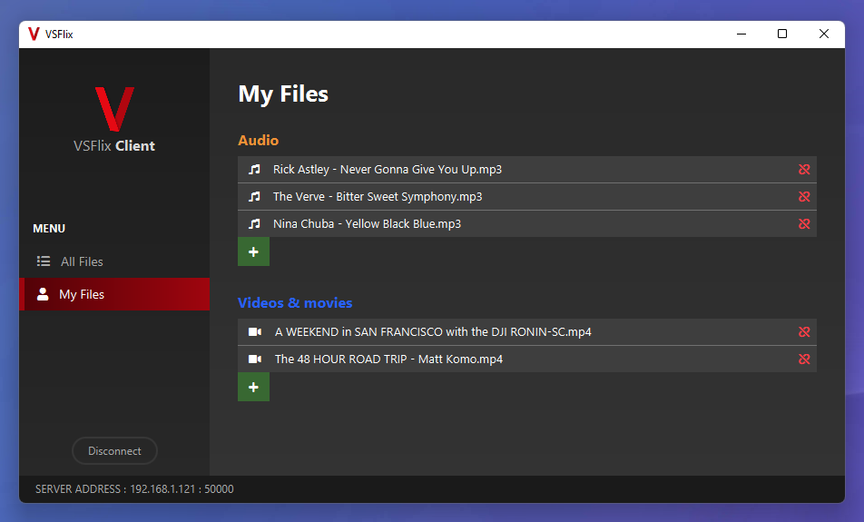

            

#

    <strong>A JavaFX media streaming application bundled with its own server</strong>

    

 

The VSFlix project's goal is to be able to make one or multiple clients communicate with a single one server in order to retrieve files shared by the clients.

## Table of Contents

1. [Getting Started](#getting-started)
2. [Technologies](#technologies)
3. [Guides and resources](#guides-and-resources)
4. [Authors](#authors)
5. [License](#license)

## Getting Started

### Running the server and the client application

Follow the steps below in order to run the project :

1. Download the project files to your computer and open the project in your favorite IDE (Eclipse, IntelliJ IDEA, etc.)
2. Download the project dependencies with Maven. _(This step is often proposed or performed automatically by the IDE)_
3. Run the server. The starting class for the server is `ch.dc.Main` in the server folder.
    
    _N. B. : The server listens any incoming connection on ip address `0.0.0.0` and uses by default port `50000`. 
If this port is already used by another process, you can change it directly in the starting class or by passing the port number as an argument when running the program._

4. Run one (or more) client(s). The starting class for the client application is `ch.dc.Main` in the client folder.

Once these 4 steps have been executed, you will be able to use the VSFlix client to stream (bidirectionnal stream) files from / to the other connected clients !

## Technologies

This project relies entirely on Java :

- The client application has been made with JavaFX
- The server and its internal HTTP server have been developed in pure Java

### Under the hood

The VSFlix client and server have there own way of communicating.
The communication is based on simple text commands that the client sends every time it needs to retrieve a particular information.

Possible commands :

| Command | Action |
| --------- | --------- | 
| HTTPPORT <http_port> | Send the client HTTP Server port to the server when the client connects. |
| GETALLFILES | Request all shared files from the server. |
| ADDFILE <FileEntry> | Send a FileEntry object for the server to add it to its shared files. |
| UNSHAREFILE <FileEntry> | Send a FileEntry object for the server to remove it from its shared files. |
| GETNBCONNECTEDCLIENTS | Request the number of connected clients. |
| DISCONNECT | Send a request to end the connection. It must be noted that the client does not wait on the server to close its own connection. |

## Guides and resources

* [JavaFX](https://openjfx.io/) - JavaFX
* [FontAwesome](https://fontawesome.com/) - FontAwesome 5 Icons
* [Maven](https://maven.apache.org/) - Dependency Management

## Authors

<table>
   <tbody>
      <tr>
         <td align="center">
            <a href="https://github.com/d-roduit">
             
            Daniel Roduit
            </a>
         </td>
         <td align="center">
            <a href="https://gitlab.com/g.cathy">
             
            Cathy Gay
            </a>
         </td>
      </tr>
   </tbody>
</table>

## License

This project is licensed under the MIT License
